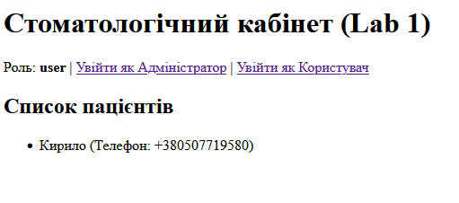
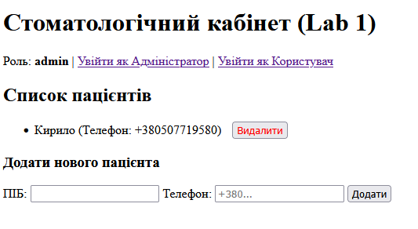

# Лабораторна робота 1: FastAPI + SQLite + Jinja2

## Опис проекту
У цій лабораторній роботі реалізовано базовий веб-додаток для системи **«Стоматологічний кабінет»**.
Було використано фреймворк **FastAPI**, серверну шаблонізацію **Jinja2** та локальну базу даних **SQLite** за допомогою ORM SQLAlchemy.

Система містить 3 основоположні сутності: 
- Лікар (`Doctor`)
- Пацієнт (`Patient`)
- Запис на прийом (`Appointment`)

Реалізовані CRUD-операції, а також базова симуляція системи ролей за допомогою GET-параметра (Адміністратор / Користувач системи). Також додано backend і frontend валідацію полів.

## Фрагмент ключового коду (main.py)
```python
def get_db():
    db = SessionLocal()
    try:
        yield db
    finally:
        db.close()

@app.get("/", response_class=HTMLResponse)
def index(request: Request, role: str = "user", db: Session = Depends(get_db)):
    patients = db.query(Patient).all()
    appointments = db.query(Appointment).all()
    
    return templates.TemplateResponse("index.html", {
        "request": request, 
        "patients": patients, 
        "appointments": appointments,
        "role": role
    })
```

## Скріншоти результату


