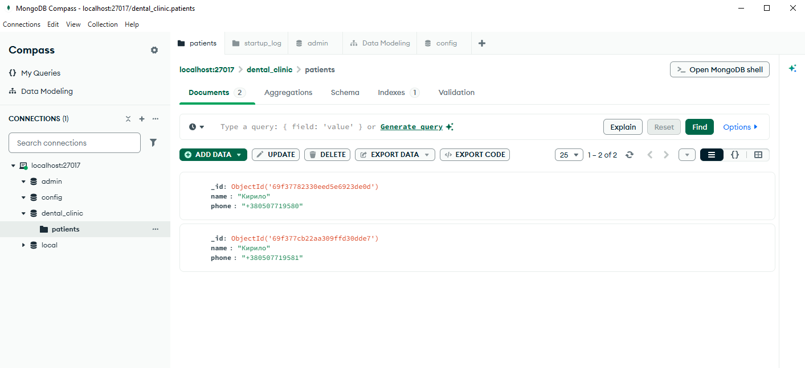

# Лабораторна робота 3: FastAPI + MongoDB

## Опис проекту
У цій лабораторній роботі здійснено перехід системи `ІС «Стоматологічний кабінет»` на NoSQL базу даних **MongoDB**. 
Було використано бібліотеку **PyMongo** для взаємодії з базою даних.

Система підтримує ті ж CRUD-операції, що й у попередніх лабораторних роботах, але тепер дані зберігаються у колекціях MongoDB.

## Фрагмент ключового коду (database.py)
```python
from pymongo import MongoClient

client = MongoClient("mongodb://localhost:27017")
db = client.clinic_db

patients_collection = db.patients
appointments_collection = db.appointments
```

## Скріншоти результату
