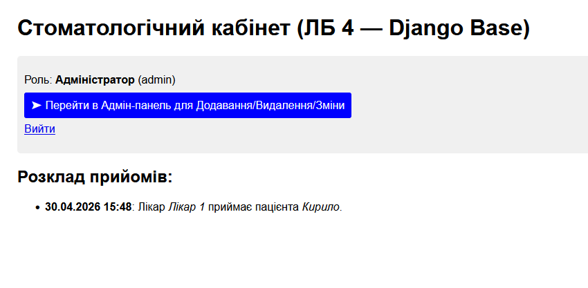

# Лабораторна робота 4: Django + ORM

## Опис проекту
У цій лабораторній роботі система `ІС «Стоматологічний кабінет»` була реалізована за допомогою фреймворку **Django**. 
Було створено моделі для сутностей `Doctor`, `Patient`, `Appointment` та налаштовано панель адміністратора для керування даними.

## Фрагмент ключового коду (models.py)
```python
class Doctor(models.Model):
    name = models.CharField(max_length=200, verbose_name="ПІБ лікаря")
    specialty = models.CharField(max_length=100, verbose_name="Спеціальність")

class Patient(models.Model):
    name = models.CharField(max_length=200, verbose_name="ПІБ пацієнта")
    phone = models.CharField(max_length=20, verbose_name="Телефон")

class Appointment(models.Model):
    doctor = models.ForeignKey(Doctor, null=True, on_delete=models.CASCADE, verbose_name="Лікар")
    patient = models.ForeignKey(Patient, on_delete=models.CASCADE, verbose_name="Пацієнт")
    time = models.DateTimeField(null=True, verbose_name="Час прийому")
```

## Скріншоти результату
