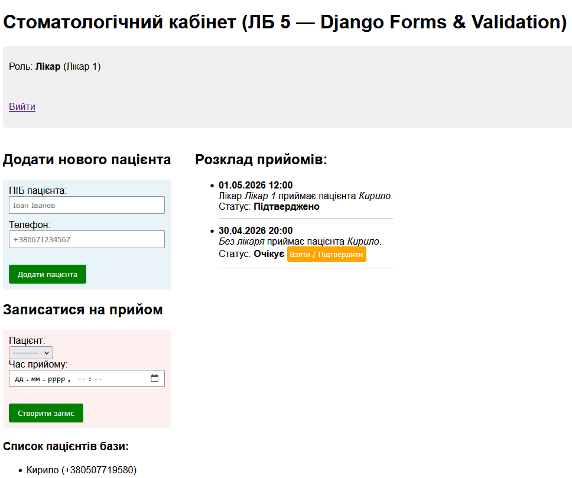

# Лабораторна робота 5: Django Forms + Ролі

## Опис проекту
У цій лабораторній роботі було додано підтримку ролей (Адміністратор, Лікар, Гість) та розширено функціонал системи `ІС «Стоматологічний кабінет»`.

### Основні функції:
- **Адміністратор**: має доступ до панелі адміністратора, може підтверджувати записи.
- **Лікар**: може брати собі записи на прийом.
- **Гість**: може переглядати розклад та додавати пацієнтів.

## Фрагмент ключового коду (views.py)
```python
def confirm_appointment(request, pk):
    if request.user.is_authenticated:
        appt = Appointment.objects.get(pk=pk)
        if hasattr(request.user, 'doctor'):
            appt.doctor = request.user.doctor
            appt.status = 'confirmed'
            appt.save()
        elif request.user.is_superuser:
            appt.status = 'confirmed'
            appt.save()
    return redirect('index')
```

## Скріншоти результату
